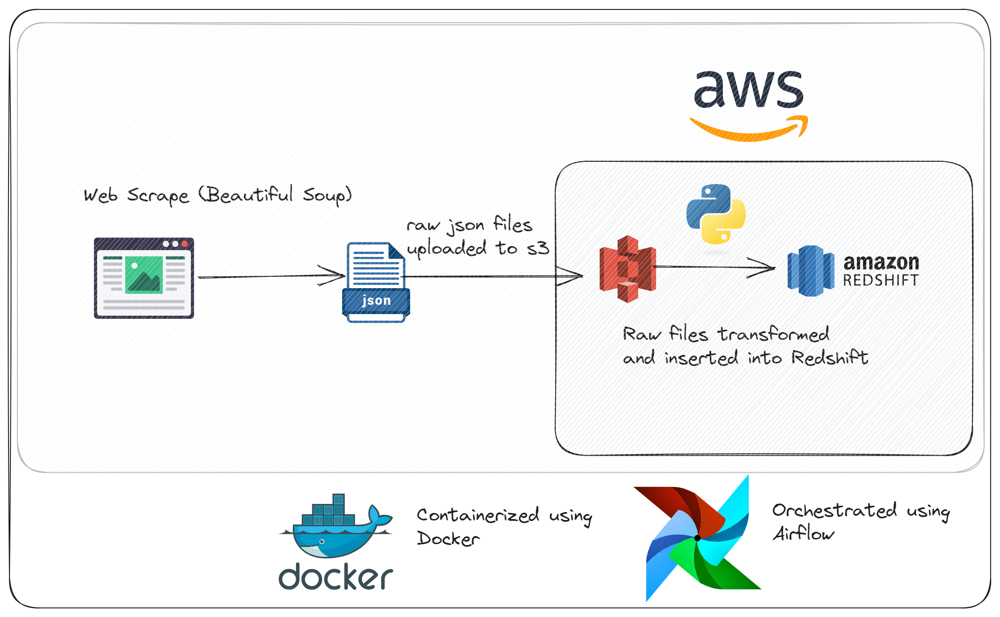
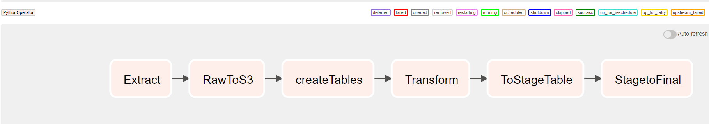

# Toronto Real Estate Data Engineering Project

I created this project to understand the fundamentals behind web scraping and how to build a fully managed ETL pipeline using Airflow, AWS, Terraform and Docker. I scraped the real estate website using Beautiful Soap, then I stored those raw files on s3 and transformed the raw files locally before finally uploading the transformed data to Redshift. In this project I made heavy use of error handling, regular expressions and type casting.

# Architecture

# Setting up Infrastructure using Terraform

   Go to the root directory of this project
   cd into terrafrom directory
   terraform apply -var "db_password=YourPassword" (This is needed to setup the password for redshift cluster)
   terraform destroy (To destroy the structure)

# How to Run

    Go to the root directory of this project
    Run docker-compose build .
    Run docker-compose up

# Airflow
1. To connect to the airflow instance running on docker, type localhost:8080 on your browser
2. You should be able to see the etl pipeline like in the picture below

   
